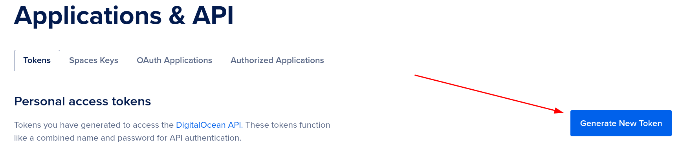
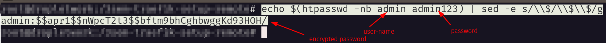

# Træfik Setup Remote


### Generate digital ocean token

- To generate a digital ocean token, go to [DigitalOcean](https://cloud.digitalocean.com/account/api/tokens) and create a new token.



- Copy the token and save it somewhere safe. You will need it later.

###  Install apache2-utils inside your droplet terminal

```bash
  sudo apt-get install apache2-utils
``` 

###  Generate a traefik hashed dashboard login (droplet linux terminal )

```bash
  echo $(htpasswd -nb <your_username> <your_password>) | sed -e s/\\$/\\$\\$/g
```



- Copy the output and save it somewhere safe. You will need it later.


### Create following folder and files

- Create a folder called `traefik` in your droplet home directory.
- Inside the `traefik` folder, create a file called `traefik.yml`
- Inside the `traefik` folder, create a folder called `acme` and inside the `acme` folder, create a file called `acme.json`
- Inside the `traefik` folder, create a environment file called `.env`
- Inside the `traefik` folder, create a docker-compose file called `docker-compose.yml`

### Set permissions for the acme folder and files

```bash
  chmod 600 ./acme
  chmod 600 acme/acme.json
```
### For Mac users with M1 and M2 chips has to make some changes to the HibernateConfig file

Do the following to get the Testcontainers up and running:

1. Run the following commands in your terminal

```bash 
    # New tag (mac m1/m2): 
    docker tag arm64v8/postgres:latest postgresql:15.3-alpine3.18
    
    # Symlink
    sudo ln -s $HOME/.docker/run/docker.sock /var/run/docker.sock
```

